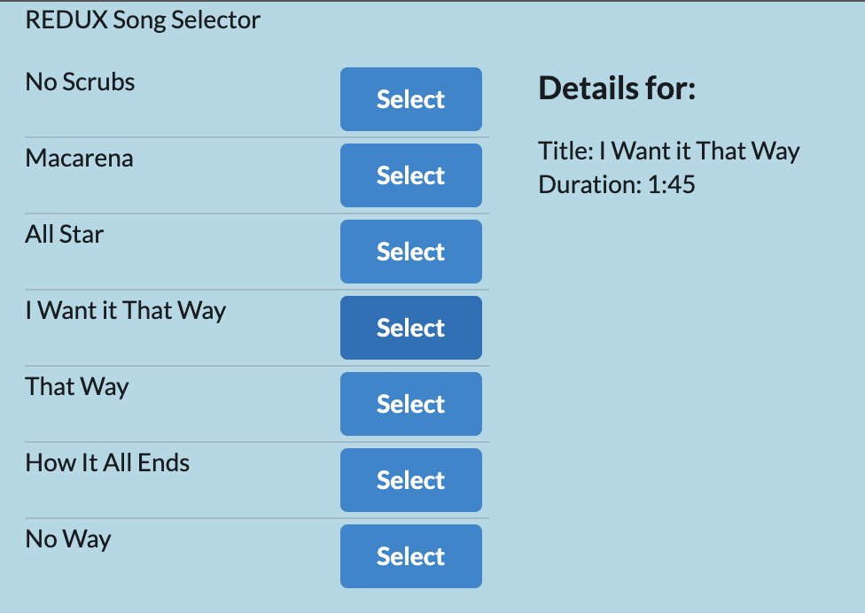

# Songs



Syncing Redux up with React:

- We are still going to create our components as we usually do
- then select some very specific components inside of our application that need to receive some information or need to make changes to our `state`. 
- If you need to make changes to our `state` or receive information, we're going to 
  - import that `connect` helper
- then at the bottom of the file, we can define a `mapStateToProps` function will then pass that function as the first argument off to `connect`. 
- And we'll put on this kind of weird syntax here, where we put the song detail or the actual component that we care about as a second function calls next to the Connect call. 

```
export default connect(mapStateToProps)(SongDetail);
```