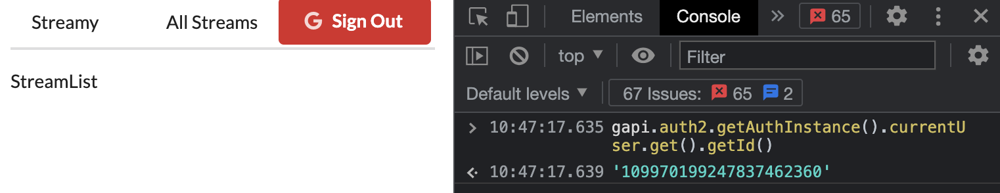

# Streams-OAuth

- `OAuth` for Browser App
- `Google API Library`
- Renders Authentication Status
- Updates Auth State
- Displays Sign In and Sign Out Buttons
- On-Demand Sign In and Sign Out
- `Redux` Architecture Design
- Connecting Auth with `Action Creators`
- `Auth Reducer`
- Handling Auth Status Through `Redux`
- `Action Types`
- Recording the User's ID
